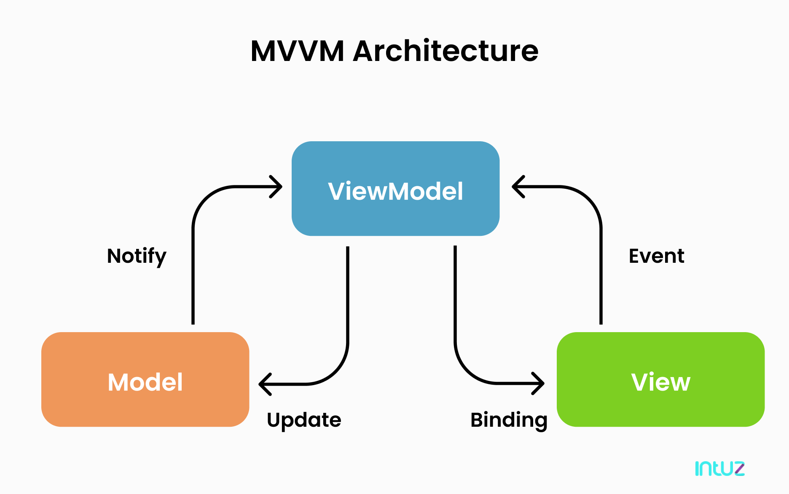

<!-- PROJECT SHIELDS -->
<!--[![Contributors][contributors-shield]][contributors-url]
[![Forks][forks-shield]][forks-url]
[![Stargazers][stars-shield]][stars-url]-->
[![Issues][issues-shield]][issues-url]
[![MIT License][license-shield]][license-url]
[![LinkedIn][linkedin-shield]][linkedin-url]

<!-- PROJECT LOGO -->
 

<h3 align="center">UE: UI MVVM Framework</h3>

  

    This project is a prototype of a MVVM Framework to be used in Unreal Engine 4.0+
     
     
    <a href="https://github.com/sebspas/UE-UI-MVVM-Framework/issues">Report Bug</a>
    ·
    <a href="https://github.com/sebspas/UE-UI-MVVM-Framework/issues">Request Feature</a>
  

<!-- TABLE OF CONTENTS -->

  
Table of Contents

  <ol>
    <li>
      <a href="#about-the-project">About The Project</a>
      <ul>
        <li><a href="#built-with">Built With</a></li>
      </ul>
    </li>
    <li>
      <a href="#getting-started">Getting Started</a>
      <ul>
        <li><a href="#prerequisites">Prerequisites</a></li>
        <li><a href="#installation">Installation</a></li>
      </ul>
    </li>
    <li><a href="#usage">Usage</a></li>
    <li><a href="#roadmap">Roadmap</a></li>
    <li><a href="#contributing">Contributing</a></li>
    <li><a href="#license">License</a></li>
    <li><a href="#contact">Contact</a></li>
    <li><a href="#acknowledgments">Acknowledgments</a></li>
  </ol>

<!-- ABOUT THE PROJECT -->
## About The Project

Unreal Engine does not have by default any pattern for your UI code development. This project goal is to provide a simple but
solid base to work on your UI.

It follows the basic principles of the MVVM design pattern (https://en.wikipedia.org/wiki/Model–view–viewmodel), but applies them to Unreal
engine.

 
- Model: Data Structure use by the UI, it regroups all the data you want to send to the UI from the Gameplay side.
    
- View: UMG Blueprint in Unreal Engine. It uses GameObject data structure sent from the viewModel. This data will be very similar to the Model except it can have Event (delegate) for the View and the ViewModel to communicate
GameObject property should be wrap in a DirtyValue class that will allow to easily bind on value changes (this will greatly reduce the number of event to create).
Each view can select one or many GameObject it needs.
    
- ViewModel -> Act as the middle man between the two. It will fetch the data from the Model and create our GameObject on initialization.
It will bind itself on different delegate inside the Data Structure that will be trigger by the view to update information.
The View Model can also trigger some Event in case the data changes, so the View update itself.
  

Keep in mind that this is a prototype I'm currently still iterating on :)

(<a href="#readme-top">back to top</a>)

<!-- USAGE EXAMPLES -->
## Usage

To use this UI Framework simply copy the content of the [Core Folder](https://github.com/sebspas/UE-UI-MVVM-Framework/tree/main/Source/HackNSlashProto/Core) into your project.
You will simply need to either use the CoreSystem provided or Make sure the MVVMSystem is initialized properly.

_For more examples, please refer to the [Game Folder](https://github.com/sebspas/UE-UI-MVVM-Framework/tree/main/Source/HackNSlashProto/Game)_

(<a href="#readme-top">back to top</a>)

<!-- ROADMAP -->
## Roadmap

- [ ] Cleanup the intialization of the MVVM to be non game dependant
- [ ] Change all the current ingame UI to the MVVM system
- [ ] MultiThread the VIewModel update
- [ ] Finish to update the readme properly
- [ ] Add proper Step and tutorial to use this (with BP examples and screenshots)

See the [open issues](https://github.com/sebspas/UE-UI-MVVM-Framework/issues) for a full list of proposed features (and known issues).

(<a href="#readme-top">back to top</a>)

<!-- CONTRIBUTING -->
## Contributing

Contributions are what make the open source community such an amazing place to learn, inspire, and create. Any contributions you make are **greatly appreciated**.

If you have a suggestion that would make this better, please fork the repo and create a pull request. You can also simply open an issue with the tag "enhancement".
Don't forget to give the project a star! Thanks again!

1. Fork the Project
2. Create your Feature Branch (`git checkout -b feature/AmazingFeature`)
3. Commit your Changes (`git commit -m 'Add some AmazingFeature'`)
4. Push to the Branch (`git push origin feature/AmazingFeature`)
5. Open a Pull Request

(<a href="#readme-top">back to top</a>)

<!-- LICENSE -->
## License

Distributed under the MIT License. See `LICENSE.txt` for more information.

(<a href="#readme-top">back to top</a>)

<!-- CONTACT -->
## Contact

Linkedin: [linkedin-url]

Project Link: [https://github.com/sebspas/UE-UI-MVVM-Framework](https://github.com/sebspas/UE-UI-MVVM-Framework)

(<a href="#readme-top">back to top</a>)

## Documentation on MVVM
* [C# MVVM Complete Example](https://riptutorial.com/mvvm/example/15507/csharp-mvvm-summary-and-complete-example)
* [MVC VS MVVM](https://fjorgedigital.com/insights/blog/whats-the-difference-between-mvc-and-mvvm/)
* [MVVM In Game Dev](https://www.gamedeveloper.com/design/a-critique-of-mvc-mvvm-as-a-pattern-for-game-development)
* [MVC In UE4](http://www.tylerpwhite.com/blog/2017/3/7/kt3vp5xxp2rfeqtgdjawio8l0cmbtw)
* [UDN Forum: Design patterns, Unreal engine and breaking the ice](https://forums.unrealengine.com/t/design-patterns-unreal-engine-and-breaking-the-ice-n00b/8426)
* [UDN Fortnite MVVM](https://udn.unrealengine.com/s/question/0D52L00004luh2WSAQ/fortnite-front-end-umg)

<!-- ACKNOWLEDGMENTS -->
## Acknowledgments

Use this space to list resources you find helpful and would like to give credit to. I've included a few of my favorites to kick things off!

* [Choose an Open Source License](https://choosealicense.com)
* [GitHub Pages](https://pages.github.com)
* [Font Awesome](https://fontawesome.com)

(<a href="#readme-top">back to top</a>)

<!-- MARKDOWN LINKS & IMAGES -->
<!-- https://www.markdownguide.org/basic-syntax/#reference-style-links -->
[contributors-shield]: https://img.shields.io/github/contributors/othneildrew/Best-README-Template.svg?style=for-the-badge
[forks-shield]: https://img.shields.io/github/forks/othneildrew/Best-README-Template.svg?style=for-the-badge
[stars-shield]: https://img.shields.io/github/stars/othneildrew/Best-README-Template.svg?style=for-the-badge
[issues-shield]: https://img.shields.io/github/issues/othneildrew/Best-README-Template.svg?style=for-the-badge
[issues-url]: https://github.com/sebspas/UE-UI-MVVM-Framework/issues
[license-shield]: https://img.shields.io/github/license/othneildrew/Best-README-Template.svg?style=for-the-badge
[license-url]: https://github.com/sebspas/UE-UI-MVVM-Framework/blob/main/LICENSE.txt
[linkedin-shield]: https://img.shields.io/badge/-LinkedIn-black.svg?style=for-the-badge&logo=linkedin&colorB=555
[linkedin-url]: https://www.linkedin.com/in/sebastien-corfa/

